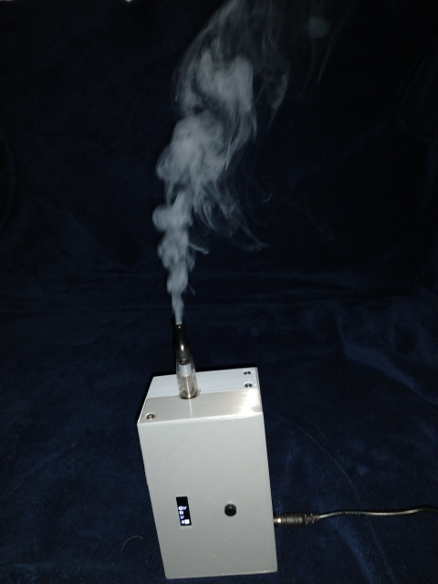

# Smoky
small hand-held smoke machine

Did you ever needed a small smoke machine for testing air flow in an computer case or around heat sinks?  
Well here it is:

## the smoke machine to go

- hand held ~ 83 x 64 x 132 (184) mm
- adjustable smoke output
- pulse mode (steam engine effect) 
- 128 x 32 oled with 5 way navigation button
- operating voltage 8-24V
- input voltage low detection

##### Table of contents
- [motivation](#motivation)
- [hardware](./doc/hw.md#Table-of-contents)
	- [schematics](./doc/hw.md#schematics)
	- [parts](./doc/hw.md#parts)
	- [assembly](./doc/hw.md#assembly)
- [software](./doc/sw.md#Table-of-contents)
- [operation](./doc/operation.md#Table-of-contents)

## motivation
while looking for a ready build smoke machine for air flow analyses I found  
- chinese smoke machines for party use for less then 30€, which are far to powerfull  
- small smoke machines for the intended use starting at ~50€ with usable models well above 100€  
- smoke machines for your garden model trains starting at ~ 100€  

I thougt the model smoke machines should be the right way to go. In an platform for railway modellists 
I found a hint to use an e-cigarette. This sounded plausible and I decided that this was the way to go. So I 
searched for e-cigarette, and parts. I found some cheap vape heads and added an usb powerd fish tank air pump.  
The concept was born  
To make it operational, I had to ad a PWM control for air flow and steam generation, a UI and a case,
For details see [hardware](./doc/hw.md#Table-of-contents) and the functional [description](./doc/description.md#Table-of-contents)  

