# the hardware

##### Table of contents
- [schematics](#schematics)
- [parts](#parts)
	- [electric parts](#electric-parts)
	- [mechaniclal parts](#mechanical-parts)
- [assembly](#assembly)
- [software](./sw.md#Table-of-contents)
- [description](./description.md#Table-of-contents)
- [home](../README.md#Table-of-contents)

## schematics
  
The system is built around an Arduino Nano. It uses an 128x32 OLED and a 5 way digital 
joystick for operation. The air pump and vaporizer are controlled by a MOSFet module.
The motor is rated at 5 V and the vaporizer is rated at 3.7 V. To reduce inrush current 
when operated at 9 - 24 V a big inductor is connected in series. The inductor is chosen so 
that the time constant is about 5-10 times as big as the PWM period. The PWM beriad is 64 us 
(=15.6 kHz).  
The vaporizer I used as described as CE4 510 vaporizer with a resitance of 2.4 Ohms. This 
results in a current of 1.6 A @ 3.7 V (1S LiPo). Bcause there are more powerful vaporizers I 
went for a saturation current of 5 A. A suitable inductor is the WE7447019 with 700 uH and 5.1 A 
saturation current. As flyback diode a used the body diode of the MOSFet because I had no power 
diode on hand.  
For the air pump I use a Fastron 09HVP-102X-50 wich is a 1 mH inductor with a saturation current 
of 0,72 A. It is a good practice to use a small capacitor in parallel to a DC motor to reduce HF 
noise. In my case i removed the capacitor because of a bad resonance. The only capacitor I had on 
hand was 100 nF this results with the 1 mH inductor in a series resonance frequency of 15.9kHz. 
When excited with the 15.6 kHz of the PWM the Voltage over Capacitor and Inductor rose to about 70 Vpp. 
Therefore I removed the capacitor. A measurement showed no significant noise. The the flyback diode I 
used was a small signal Diode 1N4150. Just what I had in the box.
As I planed to power the system with up to 24 V and the LM1117 on the Arduino is only rated for 
15 V I needed an external 5V regulator. As mentionend I used what I had on hand. This was a MP1584 
module This is quite old but it is rated for up to 30 V with a dropout voltage of ~3 V. I know there 
are better choices, but this is what I had on hand.  
The input ist connected via a voltage divider to A0 to monitor the input voltage this can be set 
either to a apropriate threshold ~8 V (5V +3 V dropout voltage) to protect the circuit or if a 
rechargeble battery is use to its discharge voltage to protect the battery.

## parts
### elcetric parts
- arduino nano  
[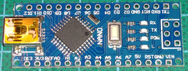](./img/src/parts/Nano.png)  
I found that some cheap clones can not be programmed via USB. Althoug I reprogrammed 
fuses and bootloader I was not able to upload the SW with the arduino IDE. Programming 
through the ISP Interface works fine, even the serial port works works as intended.  
- DCDC converter  
[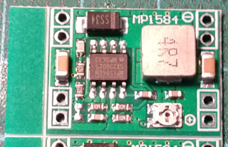](./img/src/parts/DCDC_MP1584.png)  
Although this module has two inputs and two outputs this is not an isolated converter
- MOSFet Module  
[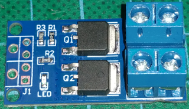](./img/src/parts/DualFET_1.png) 
[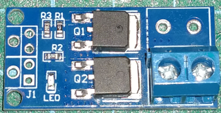](./img/src/parts/DualFET_3.png) 
[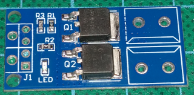](./img/src/parts/DualFET_2.png)  
I removed the some of the screw terminals because I connected the modules with thick wire from the underside. 
So I had screw terminals for power input as well as PWM output to the air pump and vaporizer.
- digital joystick  
[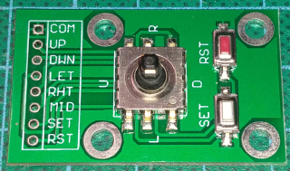](./img/src/parts/Switch_5way_navigation.png)  
- Display  
[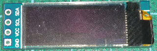](./img/src/parts/SSD1396_128x32.png)  
- Power rail  
[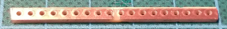](./img/src/parts/Power_Rail_5V.png)  
The input power is connected through thick wire on the underside of the DCD and MOSFet modules. 
The 5V Supply is distributed by a strip of perforated circuit board.
- vaporizer  
[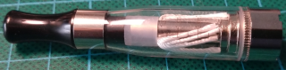](./img/src/parts/Vape_connector.png)  
[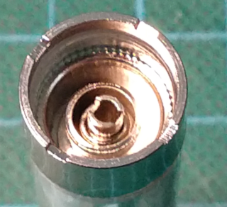](./img/src/parts/Vape_connector.png)  
This is colled a CE4 - 510 vaporizer. The heating resistor is connected between the outer metal ring 
and the inner pipe. In order to put air through it I connected a 4mm brass tube to the inner pipe and 
soldered a wire to the outer ring.  
[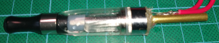](./img/src/parts/Vape_with_leads.png)  
- air pump  
[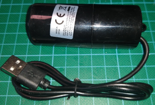](./img/src/parts/USB_powered_air_pump_w_case.png)  
This is the air pump., For better handling I removed the cover..  
[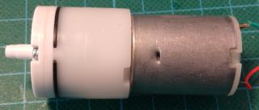](./img/src/parts/USB_powered_air_pump_wo_case.png)  
- big inductor for vaporizer  
[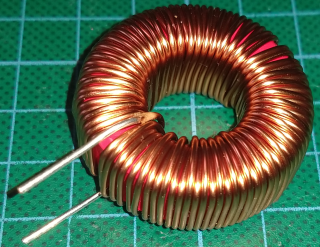](./img/src/parts/Inductor_WE7447019_700uH.png)  
- small inductor for air pump  
[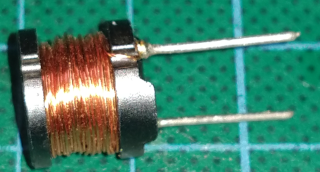](./img/src/parts/Inductor_Fastron_09HVP_1mH.png)  
### mechanical parts
I desgned some 3D printed case parts. I will not provide 3D files as most likely one will not find exactly 
same parts as I had on hand.
- lower shell  
[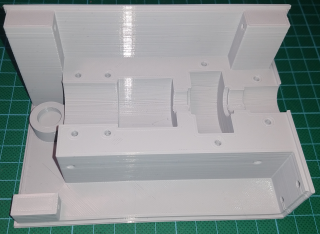](./img/src/parts/Smoky_lower_shell.png)  
The lower shell is designed to hold the air pump, vaporizer and inductors and power module carrier.  
- upper shell  
[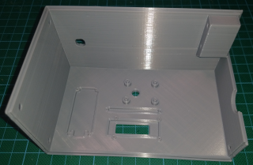](./img/src/parts/Smoky_upper_shell.png)  
The upper shell is designed to hold the Nano, display, joystick and DC Jack. Although not shown I added some 
venting holes in the bottom (left side).
- brackets and mountig parts  
[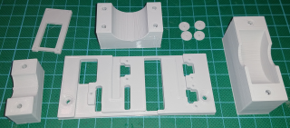](./img/src/parts/Smoky_brackets.png)  
These are 
	- the mounting brackets for the motor, vaporizer and inductor. 
	- some washers and a mounting bracket for the display
	- the carrier for the power electronics

## assembly  
The elctronics are connected with the help of some 3D printed templates (not shown).  
[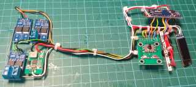](./img/src/assembly/electronic_assembly.png)  
Then the control electronics is mounted to the upper shell and the power electronics  
is mounted to the carrier.  
[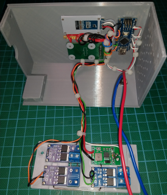](./img/src/assembly/Smoky_upper_shell_assembly_1.png)  
The air pump and the vaporizer are connected by a small silicone tube  
[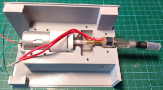](./img/src/assembly/Smoky_upper_shell_assembly_1.png)  
The silicone tube is fed through the big inductor  
[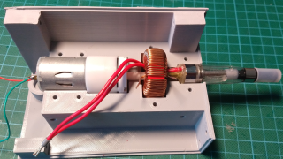](./img/src/assembly/Smoky_upper_shell_assembly_1.png)  
All three parts are kept in place with their brackets.  
[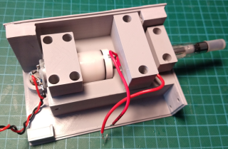](./img/src/assembly/Smoky_upper_shell_assembly_1.png)  
I designed a recess for the motor's. The components are kept in place by the solder joints.  
[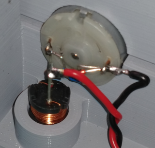](./img/src/assembly/Smoky_upper_shell_assembly_1.png)  
The power carrier is screwed to the motor mount, vaporizer, motor and the DC jack are connected to their terminals.  
[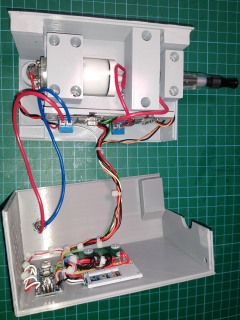](./img/src/assembly/Smoky_shell_assembly.png)  
Last the case is closed  
[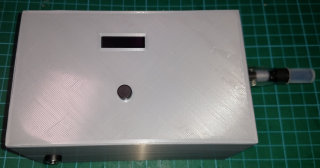](./img/src/assembly/Smoky_full.png)  

