# operation

##### Table of contents
- [principle of operation](#principle-of-operation)
- [menu icons](#menu-icons)
	- [Menu](#Menu)
	- [Smoke](#Smoke)
	- [Settings](#Settings)
	- [Info](#Info)
	- [Mode](#Mode)
	- [Heat](#Heat)
	- [Air](#Air)
	- [Battery](#Battery)
	- [DutyCycle](#DutyCycle)
	- [Period](#Period)
	- [Sequence](#Sequence)
	- [HeatStart](#HeatStart)
	- [HeatSmoke](#HeatSmoke)
	- [HeatHold](#HeatHold)
	- [AirStart](#AirStart)
	- [AirSmoke](#AirSmoke)
	- [AirHold](#AirHold)
	- [LimitHigh](#LimitHigh)
	- [LimitLow](#LimitLow)
	- [Power](#Power)
	- [Duration](#Duration)
	- [Delay](#Delay)
	- [BatteryLow](#BatteryLow)
	- [Back](#Back)
	- [Reset](#Rest)
	- [Cancel](#Cancel)
	- [Ok](#Ok)
- [menu structure](#menu-structure)
	- [main menu](#main-menu)
		- [smoke menu](#smoke-menu)
		- [settings menu](#settings-menu)
			- [mode menu](#mode-menu)
				- [duty cycle menu](#duty-cycle-menu)
				- [period menu](#period-menu)
				- [sequence menu](#sequence-menu)
			- [heat menu](#heat-menu)
				- [rated heat power](#rated-heat-power)
				- [heat start menu](#heat-start-menu)
					- [heat start delay](#heat-start-delay)
					- [heat start power](#heat-start-power)
					- [heat start duration](#heat-start-duration)
				- [heat smoke power](#heat-smoke-power)
				- [heat hold-menu](#heat-hold-menu)
					- [heat hold power](#heat-hold-power)
					- [heat hold duration](#heat-hold-duration)
			- [air menu](#air-menu)
				- [rated air power](#rated-air-power)
				- [air start menu](#air-start-menu)
					- [air start delay](#air-start-delay)
					- [air start power](#air-start-power)
					- [air start duration](#air-start-duration)
				- [air smoke power](#air-smoke-power)
				- [air hold-menu](#air-hold-menu)
					- [air hold power](#air-hold-power)
					- [air hold duration](#air-hold-duration)
			- [battery menu](#battery-menu)
				- [battery low threshold](#battery-low-threshold)
				- [battery info](#battery-info)
			- [reset menu](#reset-menu)
		- [info menu](#info-menu)
- [home](../readme.md#Table-of-contents)

## principle of operation
The smoke machine has four states of operation as shown in th diagram:  
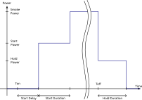]
1. start delay  
when activated, the PWM idles for the desired period 
1. start phase  
when activated the PWM is set to the desired power for the desired period 
1. smoke phase  
when the sart phase (start delay + start duartion) is finished the PWM 
enters the smoke phase with the desired power. This phase will persist 
until the smoke is turned off. 
1. hold phase  
when the the smoke is turned off, the system enters the hold phase. In 
this phase the PWM is held at the desired power for the desired period. 
After the hold phase the PWM is turned off.  
These phases can be programmed for both heat and air PWM.  
E,g, one can preheat the vaprizere without air during setting a heat 
start power and start duration while setting a start delay for air. To 
force  faster cooling of the vaporizer one can disabele the hold phase 
for heat and enable it for air.  

## menu icons
### Menu
[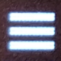](./img/Src/icon/iconMenu.png)  
The "hamburger" icon indicates the main menu. This is the top level
### Smoke
[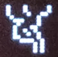](./img/Src/icon/iconSmoke.png)  
leads to the control of the smoke function  
### Settings
[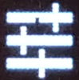](./img/Src/icon/iconSettings.png)  
This icon is used in both the main menue to acces the operational parameters  
### Info
  
This icon is used in both the main menue and the battery menu to display 
system information or the input voltage  
### Mode
  
The mode icon is used to acces the parameters for the intervall operation.  
### Heat
[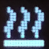](./img/Src/icon/iconHeat.png)  
The heat icon is used to access the menus and parameters for vaporizer controll.
### Air
[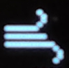](./img/Src/icon/iconAir.png)  
The heat icon is used to access the menus and parameters for air pump controll.
### Battery
[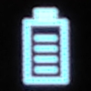](./img/Src/icon/iconBattery.png)  
### DutyCycle
[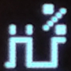](./img/Src/icon/iconDutyCycle.png)  
This icon is used in the mode menu to set the duty cacle for intervall operation.
### Period
[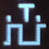](./img/Src/icon/iconPeriod.png)  
This icon is used in the mode menu to adjust the interval period
### Sequence
[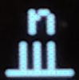](./img/Src/icon/iconSequence.png)  
This icon is used in the mode menu to adjust the number of cacles in interval mode
### HeatStart
[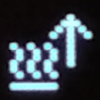](./img/Src/icon/iconHeatStart.png)  
This icon indicates the menu for the start phase parameters for the vaporizer 
### HeatSmoke
[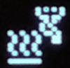](./img/Src/icon/iconHeatSmoke.png)  
This icon indicates power setting for the smoke for the vaporizer 
### HeatHold
[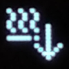](./img/Src/icon/iconHeatHold.png)  
This icon indicates the menu for the stop phase parameters for the vaporizer 
### AirStart
[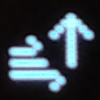](./img/Src/icon/iconAirStart.png)  
This icon indicates the menu for the start phase parameters for the air pump 
### AirSmoke
[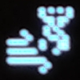](./img/Src/icon/iconAirSmoke.png)  
This icon indicates power setting for the smoke for the air pump 
### AirHold
[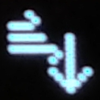](./img/Src/icon/iconAirHold.png)  
This icon indicates the menu for the stop phase parameters for the air pump 
### LimitHigh
[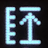](./img/Src/icon/iconLimitHigh.png)  
This icon is used in both heat and air menu to set the rated power
### LimitLow
[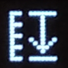](./img/Src/icon/iconLimitLow.png)  
this icon is used in the battery menu to set the minimum input voltage
### Power
[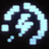](./img/Src/icon/iconPower.png)  
this icon is used in both heat and air menu to set the power rating in start smoke and stop phase
### Duration
  
this icon is used in both heat and air menu to set the duration of the start and stop phase
### Delay
[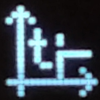](./img/Src/icon/iconDelay.png)  
this icon is used in both heat and air menu to set the start delay
### BatteryLow
  
this icon is displayed when the input voltage drops below the low limit when smoke is aktive
### Reset
  
this icon indicates the reset menu. there is only one icon: ok
### Cancel
[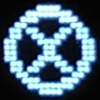](./img/Src/icon/iconCancel.png)  
this icon is used in the last menu levels when there is a numerical value to edit. when used 
to exit the menu thechanges to the parameter will be discarded.
### Ok
  
only used in rest menu to activate hw reset.  

## menu structure
The menu is displayed in 2 lines. the first icon on each line represents the menu level. 
The following icons are the menu items. If there is a submenu it will be displayed in the 
second line, if not it is the last level which is either an editable value, information or 
an executable fuction 

### main menu
[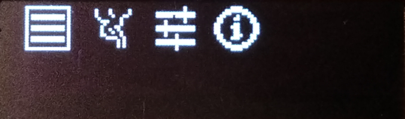](./img/src/menu/Menu_1_0________main.png)  
From the top level menu the smoke menu, the settings menu and the system information menu can be accessed:
- smoke menu  
[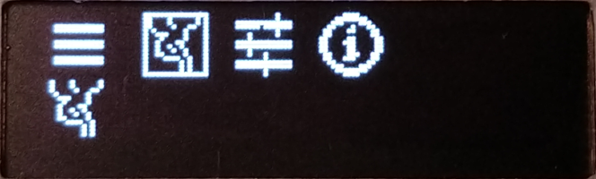](./img/src/menu/Menu_1_1________main-smoke.png)  
- settings menu  
[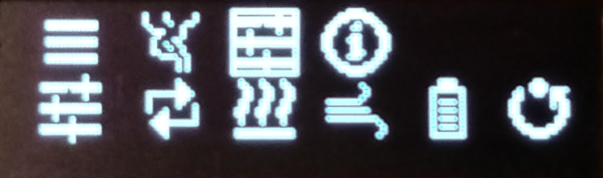](./img/src/menu/Menu_1_2________main-settings.png)  
- system info  
[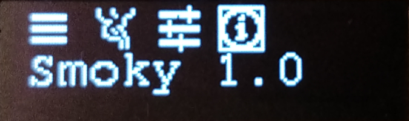](./img/src/menu/Menu_1_3________main-info.png)  

### smoke menu
when entering the smoke menue the smoke function can be activated or deactivated by pressing the center button. 
If the button is held down the smoke function is active as long as the button is pressed  
[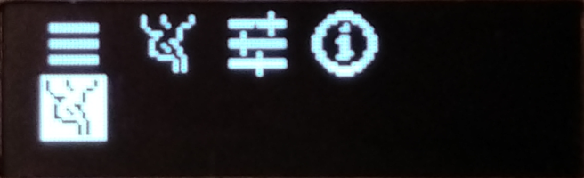](./img/src/menu/Menu_1_1________main-smoke.png)  
Active smoke is indicated by a moving cloud  
[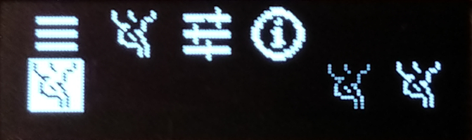](./img/src/menu/Menu_1_1________main-smoke.png)  

### settings menu
[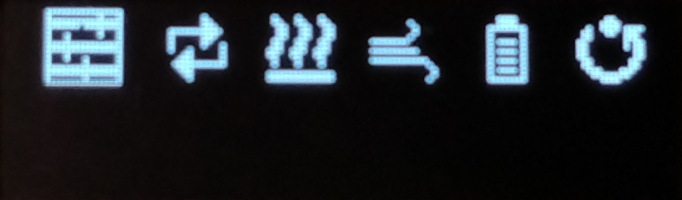](./img/src/menu/Menu_1_2_0______main-settings-menu.png)  
from the settings menu all parmeter menus can be accessed  
- mode menu  
[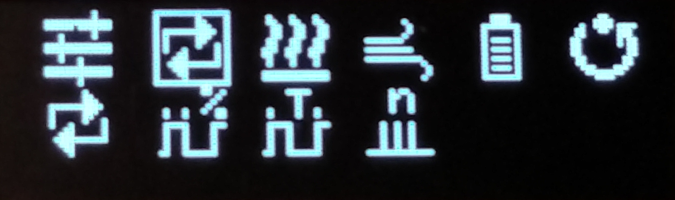](./img/src/menu/Menu_1_2_1______main-settings-cycle.png)  
- heat menu  
[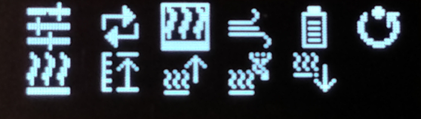](./img/src/menu/Menu_1_2_2______main-settings-heat.png)  
- air menu  
[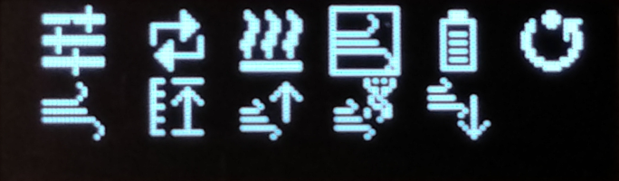](./img/src/menu/Menu_1_2_3______main-settings-air.png)  
- battery menu  
[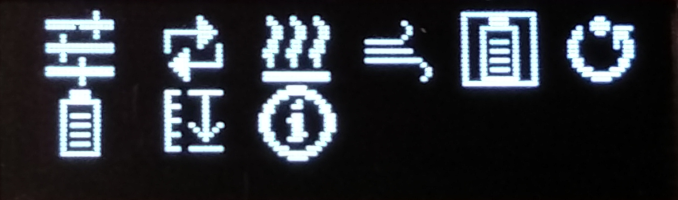](./img/src/menu/Menu_1_2_4______main-settings-battery.png)  

#### mode menu
[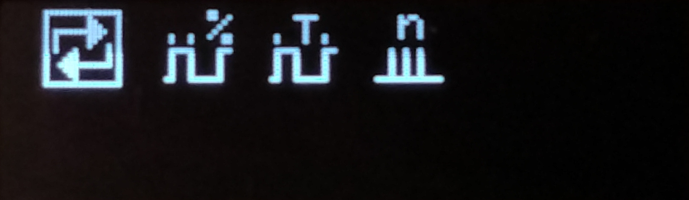](./img/src/menu/Menu_1_2_1_0____main-settings-cycle-menu.png)  
Each of the three mode menu entries is a bottom level entry. Through each of 
the three menu items the correspondign parameter can be modified.  
When not operated in continuous mode the three parameters duty cycle, period 
and sequence are used to set the cycle mode.

##### duty cycle menu
[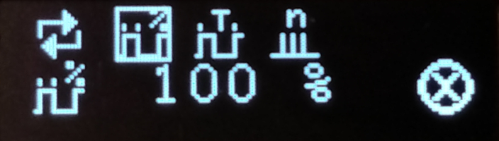](./img/src/menu/Menu_1_2_1_1____main-settings-cycle-duty_cycle.png)  
The duty cycle set the part of the cycle period in which the smoke is active. 
For continuous operation this should be set to 100 %.  

##### period menu
[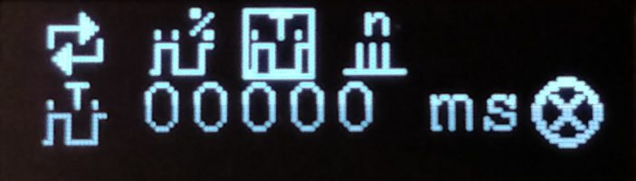](./img/src/menu/Menu_1_2_1_2____main-settings-cycle-periode.png)  
The period sets the period of each cycle in interval mode. For continous mode 
this parameter should be set to zero.  

##### sequence menu
[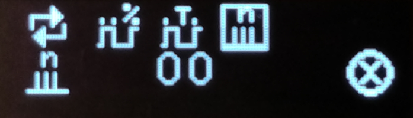](./img/src/menu/Menu_1_2_1_3____main-settings-cycle-cycles.png)  
The sequence parameters sets the number of cycles in interval mode. The smoke 
operiation ends itself after the desired number of cycles. For infinite number 
of cycles or continous mode this parameter has to be set to zero.  

#### heat menu
[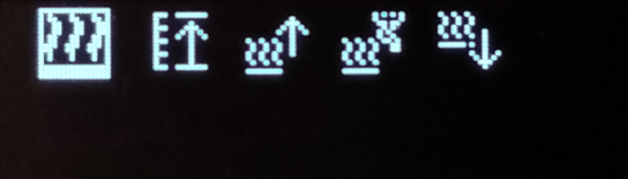](./img/src/menu/Menu_1_2_2_0____main-settings-heat-menu.png)  
The heat menu has two sub menus  
- heat - start  
[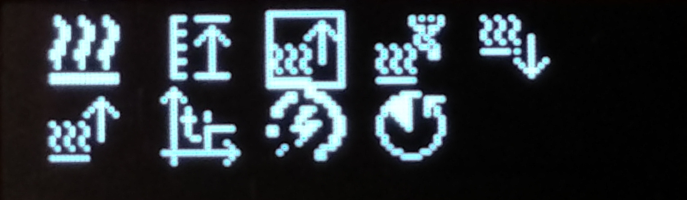](./img/src/menu/Menu_1_2_2_2____main-settings-heat-start.png)  
- heat - hold  
[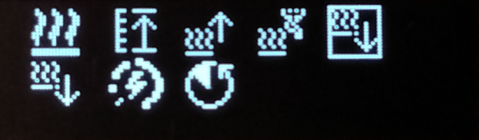](./img/src/menu/Menu_1_2_2_4____main-settings-heat-stop.png)  
  
The menu items rated heat power and heat smoke power are bottom level menu items.

##### rated heat power
[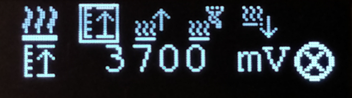](./img/src/menu/Menu_1_2_2_1____main-settings-heat-power_limit.png)  
This parameter sets the rated voltage of the vaporizer. There is no need to set this 
value higher as the rated voltage. More power can be obtained by setting the power 
levels of the desired phase. Values of 150 % are allowed.   

#### heat start menu
[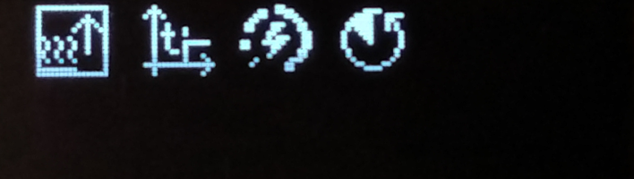](./img/src/menu/Menu_1_2_2_2_0__main-settings-heat-start-menu.png)  
All three menu items, delay, power and duration are bottom level entries. The 
parameters define the start up behaviour of the vaporizer.  

##### heat start delay
[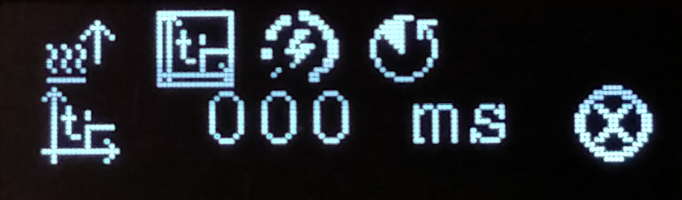](./img/src/menu/Menu_1_2_2_2_1__main-settings-heat-start-delay.png)  
This parameter sets the start up delay. A maximum of 750 ms is allowed.

##### heat start power
[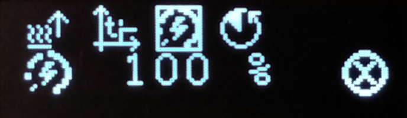](./img/src/menu/Menu_1_2_2_2_2__main-settings-heat-start-power.png)  
This parameter sets the vaporizer voltage during startup. the value is relative 
to the rated heat power and can be set upt to 150 %.  

##### heat start duration
[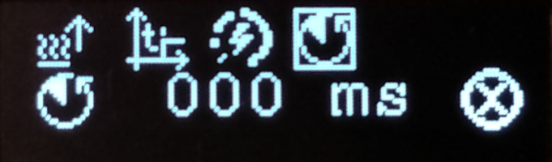](./img/src/menu/Menu_1_2_2_2_3__main-settings-heat-start-duration.png)  
This parameters sets the duration for which the start up power will be applied. 
A maximum duration of 750 ms is allowed.  

#### heat smoke power
[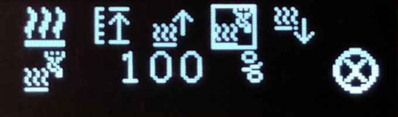](./img/src/menu/Menu_1_2_2_3____main-settings-heat-run.png)  
This parameter sets the power during smoke production. A value of up to 150 % 
relative to the rated power is allowed.  

#### heat hold menu
[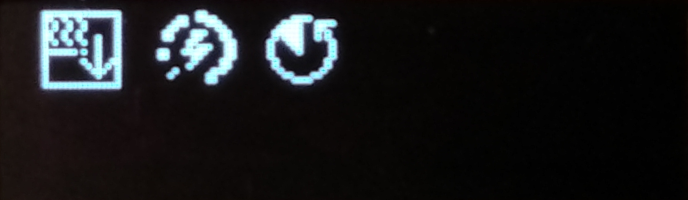](./img/src/menu/Menu_1_2_2_4_0__main-settings-heat-stop-menu.png)  
Both menu items, power and duration are bottom level entries. The parameters 
define the hold behaviour of the vaporizer.  

##### heat hold power
[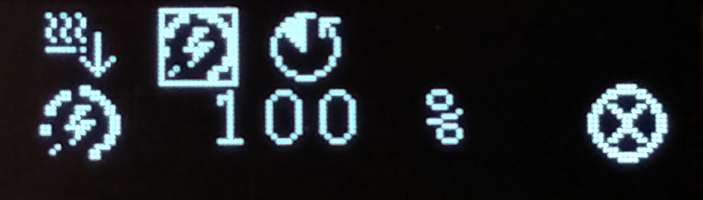](./img/src/menu/Menu_1_2_2_4_1__main-settings-heat-stop-power.png)  
This parameter sets the hold power. A value of up to 150 % 
relative to the rated power is allowed.  .

##### heat hold duration
[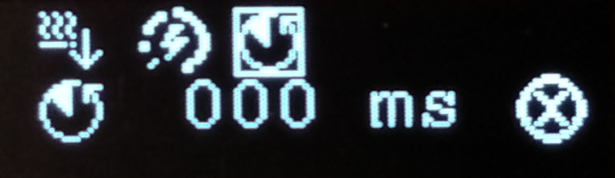](./img/src/menu/Menu_1_2_2_4_2__main-settings-heat-stop-duration.png)  
This parameter sets duration of the hold phase. A maximum of 750 ms is allowed.

### air menu
[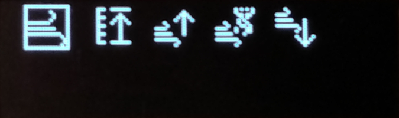](./img/src/menu/Menu_1_2_3_0____main-settings-air-menu.png)  
The heat menu has two sub menus  
- air - start  
[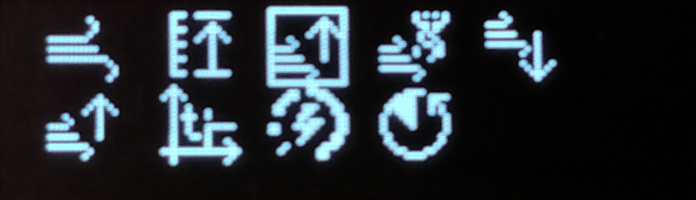](./img/src/menu/Menu_1_2_3_2____main-settings-air-start.png)  
- air - hold  
  
  
The menu items rated air power and air smoke power are bottom level menu items.

#### rated air power
  
This parameter sets the rated voltage of the air pump. There is no need to set this 
value higher as the rated voltage. More power can be obtained by setting the power 
levels of the desired phase. Values of 150 % are allowed.   

#### air start menu
  
All three menu items, delay, power and duration are bottom level entries. The 
parameters define the start up behaviour of the air pump.  

##### air start delay
  
This parameter sets the start up delay. A maximum of 750 ms is allowed.

##### air start power
  
This parameter sets the air pump voltage during startup. the value is relative 
to the rated heat power and can be set upt to 150 %.  

##### air start duration
  
This parameters sets the duration for which the start up power will be applied. 
A maximum duration of 750 ms is allowed.  

#### air smoke power
  
This parameter sets the power during smoke production. A value of up to 150 % 
relative to the rated power is allowed.  

#### air hold-menu
  
Both menu items, power and duration are bottom level entries. The parameters 
define the hold behaviour of the air pump.  

##### air hold power
  
This parameter sets the hold power. A value of up to 150 % 
relative to the rated power is allowed.  .

##### air hold duration
  
This parameter sets duration of the hold phase. A maximum of 750 ms is allowed.

### battery menu
  
Both items of the battery menu are bottom level entries.  

#### battery low threshold
  
Thes parameters sets the minimum input voltage during operation. This value is 
only monitored when smoke is aktive if the input voltage drops below the 
threshold for a certain period, the system disables smoke and enters battery 
low mode.  
  
The system will be locked. It can only be restarted by disconnecting 
the power suppply.  

#### battery info
  
When selecting this menu item the current input voltage will be displayed and updated every 300 ms

### reset menu
  
This is a bottom level menu. There is no editable parameter but by pressing the 
center button while the cursor is located at the ok button a hard reset will be performed.

## info menu
  
The info menu is a bottom level menu. It contains no editable paramters.
When the menu is selected the program version will be displayed in the lower line.  
When the menu is activated, the SW version wil be displayed in the upper line and 
the built date will be displayed in the lower line. The system will return to the 
main menue after a few seconds.  
